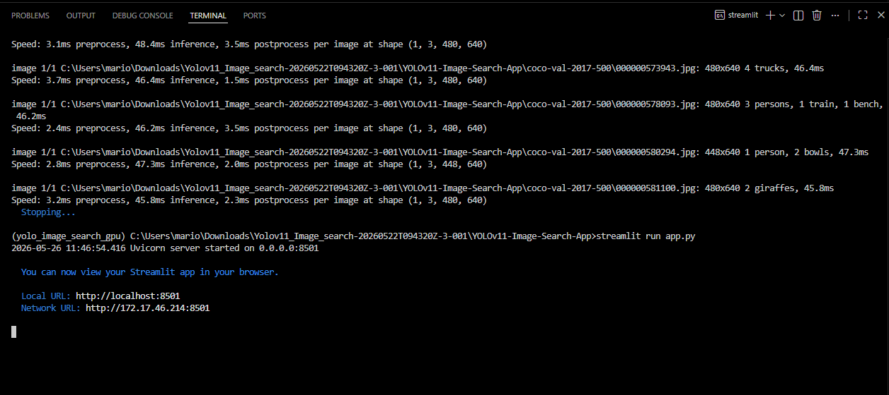
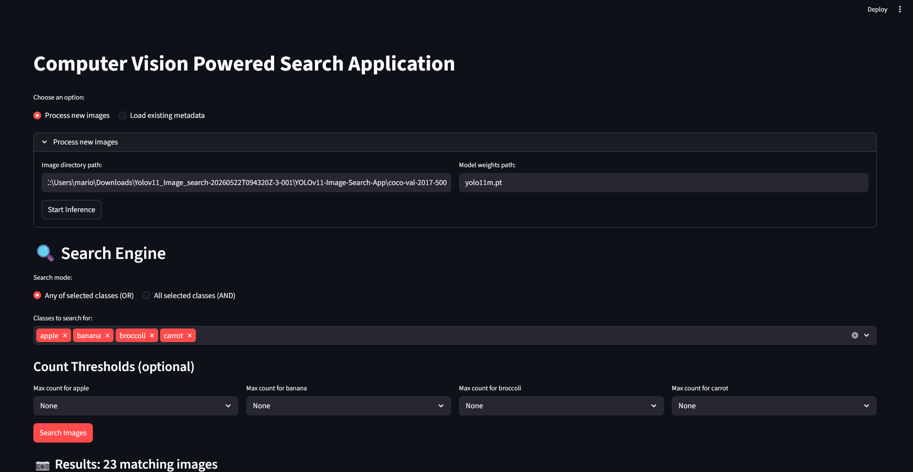
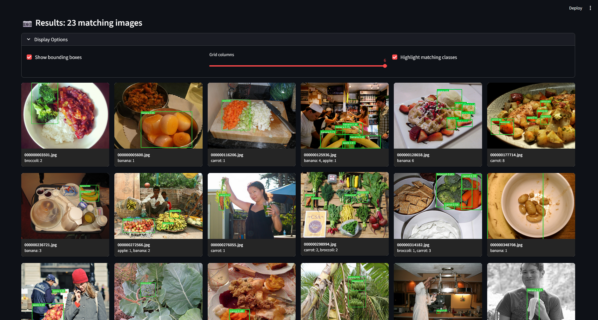

# YOLOv11 Image Search App

## YOLOv11 Image Search App using Streamlit

## Abstract
This project is a simple object detection web app. It uses YOLOv11 to detect objects from an uploaded image and shows the result in a Streamlit web page.

## Dataset & YOLO Model Details (COCO)
The YOLOv11 model is trained on the COCO dataset. COCO contains many common objects like person, car, dog, cat, bottle, chair, laptop, etc.

## Environment Setup
Required tools:
- Python 3.11
- Anaconda / Miniconda
- VS Code
- Git

### Clone the project:

```
git clone https://github.com/Mario-Viofer-J/YOLOv11-Image-Search-App.git
cd YOLOv11-Image-Search-App
```

## GPU Installation Steps
```
conda create -n yolo_image_search python=3.11 -y
conda activate yolo_image_search
pip install -r requirements.txt
```

## CPU Installation Steps
```
conda create -n yolo_image_search_gpu python=3.11 -y
conda activate yolo_image_search_gpu
pip install torch torchvision torchaudio --index-url https://download.pytorch.org/whl/cu121
pip install -r requirements.txt
```

## How to Run in VS Code using Conda

Open the project folder in VS Code.

Open terminal and run:

```
conda activate yolo_image_search
streamlit run app.py
```

Then open the local Streamlit link shown in the terminal.

## How to Deploy using Streamlit
- Push the project to GitHub.
- Open Streamlit Community Cloud.
- Click New App.
- Select this repository.
- Set main file as app.py.
- Click Deploy.
## Output Screenshots

#### Streamlit Run Command

#### Streamlit Web UI


#### Object Detection Result


## Innovations Added
- Simple Streamlit UI
- Image upload option
- YOLOv11 object detection
- Bounding box output
- CPU and GPU support
- Easy deployment using Streamlit

## Results & Conclusion

The app successfully detects objects from uploaded images using YOLOv11. It is simple, easy to use, and useful for learning object detection with Streamlit